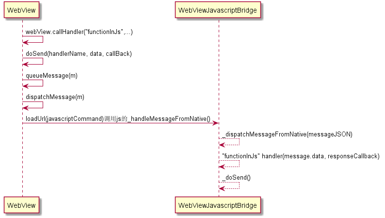

# JsBridge-master —— Web与Native交互
JSBridge 利用 WebViewJavascriptBridge 实现 Javascript 和 Native 的交互。

## 1. 背景 ##
首先介绍一下采用 WebView 开发和采用原生开发的客户端的优缺点。
#### 1.1 使用 WebView： ####
    优点：便于敏捷开发、便于维护和可以热修复和定制
    缺点：UI 没原生的美观

#### 1.2 使用原生开发： ####
    优点：当然是可以方便使用原生 UI
    缺点：无法热修复等

## 2. 原理 ##
JSBridge 是 Native 代码与 JS 代码的通信桥梁。目前的一种统一方案是:**H5 触发 url scheme->Native 捕获 url scheme -> 原生分析执行 -> 原生调用 H5**。如下图


## 3. Download ##
### Gradle ###
```gradle
dependencies {
    implementation 'com.henley.android:jsbridge:1.0.1'
}
```

### APK Demo ###

下载 [JSBridge](./JsBridge-v1.0.1.apk)

## 4. 准备工作 ##
#### 4.1 传送的消息结构见 Message 类： ####
```java
    private String data;            //data of message
    private String callbackId;      //callbackId
    private String responseId;      //responseId
    private String handlerName;     //name of handler
    private String responseData;    //responseData
```

#### 4.2 工具类：JsBridgeHelper： ####
从 JS 返回的 Url 中获取函数名
```java
    static String parseFunctionName(String jsUrl)
```

从 JS 返回的 Url 中获取 Data
```java
    static String getDataFromReturnUrl(String jsUrl)
```

从 JS 返回的 Url 中获取方法名称
```java
    static String getFunctionFromReturnUrl(String jsUrl)
```

生产 Callback 的唯一标识
```java
    static String generateCallbackId(long uniqueId)
```

从 Url 中加载 JS(JS 文件将注入为第一个 Script 引用)
```java
    static void webViewLoadJs(WebView view, String url)
```

注入本地 Javascript
```java
    static void webViewLoadLocalJs(WebView webView, String assetFilePath)

将 Assets 文件转换为字符串
```java
    static void assetFile2Str(Context context, String fileName)
```
## 5. 初始化 ##
#### 5.1 Native 端的初始化： ####
#### 设置默认处理程序，用于处理由 JavaScript 发送的没有指定处理程序名称的消息： ####
```java
    webView.setDefaultHandler(new BridgeHandler() {
        @Override
        public void handler(String data, Callback callback) {
            // 处理消息内容
            if (callback != null) {
                callback.onCallback("通知JS结果");
            }
        }
    });
```

#### 注册处理程序，以供 JavaScript 调用： ####
```java
    webView.registerHandler(handlerName, new JsHandler() {
        @Override
        public void onHandler(String handlerName, String data, Callback callback) {
            // 处理消息内容
            if (callback != null) {
                callback.onCallback("通知JS结果");
            }
        }
    });
```

#### Native调用 JavaScript 注册的处理程序： ####
```java
    webView.callHandler(handlerName, javaData, new JavaCallHandler() {
        @Override
        public void onHandler(String handlerName, String jsResponseData) {
            // 处理消息内容
        }
    });
```

#### Native 发送消息给 JavaScript： ####
```java
    webView.send(javaData, new Callback() {
        @Override
        public void onCallback(String data) {
            // 处理消息内容
        }
    });
```

#### 5.2 Web 端的初始化： ####
#### 初始化函数，注册处理程序，以供 Native 调用(第一次连接时调用)： ####
```java
    connectWebViewJavascriptBridge(function(bridge) {
        bridge.init(function(message, responseCallback) {
            // 处理消息内容
            responseCallback('通知Java结果');
        });

        bridge.registerHandler(handlerName, function(data, responseCallback) {
            // 处理消息内容
            responseCallback('通知Java结果');
        });
    })
```

#### 注册处理程序，以供 Native 调用： ####
```java
    window.WebViewJavascriptBridge.callHandler(
        handlerName
        , JsData
        , function(responseData) {
            // 处理消息内容
        }
    );
```

## 6. Native 调用 Javascript ##
原理：是通过 WebView 的 `webview.loadUrl("javascript:WebViewJavascriptBridge._handleMessageFromNative('%s');" )` 调用时序图如下图：


参照时序图基本上就了解了 Android 端调用 JavaSript 的流程。这里补充说一下 JS 的 `_dispatchMessageFromNative()` 函数中调用的 `handler` 的名字 `functionInJs` 是客户端、Web 前端提前约定好的。而最后调用的 `_doSend()` 就是 Javasript 回调给 Java 的了。

Native 通过 `WebViewJavascriptBridge` 调用 H5 的 JS 方法或者通知 H5 进行回调：
```java
    String javascriptCommand = String.format("javascript:WebViewJavascriptBridge._handleMessageFromNative('%s');", messageJson);
    if (Thread.currentThread() == Looper.getMainLooper().getThread()) {
        mWebView.loadUrl(javascriptCommand); // 调用WebViewJavascriptBridge._handleMessageFromNative(messageJson)这个JS方法
    }
```

如上，实际上是通过 `WebViewJavascriptBridge` 的 `_handleMessageFromNative()` 方法传递数据给 H5。其中的 messageJSON 数据格式根据两种不同的类型，分别为：
 - Native 通知 H5 页面进行回调
 - Native 主动调用 H5 方法

## 7. Javascript 调用 Native ##
原理：是通过 `WebViewJavascriptBridge` 的 `callHandler(handlerName, data, responseCallback)` 方法来调用原生 API，调用时序图如下图：


参照时序图，大致了解了调用过程。实现原理的思想也比较简单，利用 JS 的 iFrame(不显示)的 src 动态变化，触发 Java 层 webClient 的 `shouldOverrideUrlLoading()`，然后让本地去调用 Javasript。

在执行 `callHandler` 时，内部经历了以下步骤:
  1. 判断是否有回调函数，如果有，生成一个回调函数 ID，并将 ID 和对应回调添加进入回调函数集合 `responseCallbacks` 中
  2. 通过特定的参数转换方法，将传入的数据，方法名一起，拼接成一个 url scheme
  3. 使用内部早就创建好的一个隐藏 iframe 来触发 scheme
  4. 原生捕获到这个 scheme 后会进行分析，而相应的 `shouldOverrideUrlLoading()` 中调用 `handlerReturnData()` 这个方法
  注意：正常来说是可以通过 `window.location.href` 达到发起网络请求的效果的，但是有一个很严重的问题，就是如果我们连续多次修改 `window.location.href` 的值，在 Native 层只能接收到最后一次请求，前面的请求都会被忽略掉。所以JS端发起网络请求的时候，需要使用 iframe，这样就可以避免这个问题。

## 8. Native 如何得知 API 被调用 ##
在 Android 中(WebViewClient 里)，通过 `shouldoverrideurlloading()` 方法可以捕获到 url scheme 的触发
```java
    public boolean shouldOverrideUrlLoading(WebView view, String url){
	    //读取到url后自行进行分析处理

	    //如果返回false，则WebView处理链接url，如果返回true，代表WebView根据程序来执行url
	    return true;
    }
```
另外，Android 中也可以不通过 `iframe.src` 来触发 scheme，Android 中可以通过 `window.prompt(uri, "");` 来触发 scheme，然后 Native 中通过重写 `WebViewClient` 的 `onJsPrompt()` 来获取 Uri。

## 9. 分析 Url-参数和回调的格式 ##
```java
    if (url.startsWith(JsBridgeHelper.JSBRIDGE_RETURN_DATA)) { // 判断是否是返回数据
        helper.handlerReturnData(url); // 处理返回数据
        return true;
    } else if (url.startsWith(JsBridgeHelper.JSBRIDGE_PROTOCOL_SCHEME)) { // 刷新消息队列
        helper.flushMessageQueue();
        return true;
    }
```
Native 接收到 Url 后，可以按照这种格式将回调参数 id、API 名、参数提取出来，然后按如下步骤进行:
  1. 根据API名，在本地找寻对应的 API 方法,并且记录该方法执行完后的回调函数 ID
  2. 根据提取出来的参数，根据定义好的参数进行转化(如果是 JSON 格式需要手动转换，如果是 String 格式直接可以使用)
  3. 原生本地执行对应的 API 功能方法
  4. 功能执行完毕后，找到这次 API 调用对应的回调函数 ID，然后连同需要传递的参数信息，组装成一个 JSON 格式的参数，回调的 JSON 格式为:{responseId:回调ID,responseData:回调数据}
    a. responseId String 型 Web页面中对应需要执行的回调函数的 ID，在 Web 中生成 url scheme 时就已经产生
    b. responseData JSON 型 Native 需要传递给 Web 的回调数据，是一个 JSON 格式: {code:(整型,调用是否成功,1成功,0失败),result:具体需要传递的结果信息,可以为任意类型,msg:一些其它信息,如调用错误时的错误信息}
  5. 通过 JSBridge 通知 Web 页面回调
```java
        JSBridge._handleMessageFromNative(messageJSON);	// 将回调信息传给H5
```

